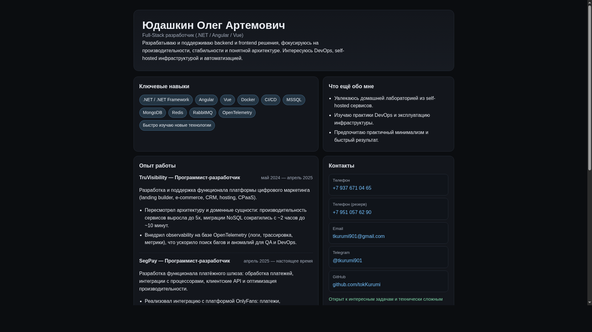
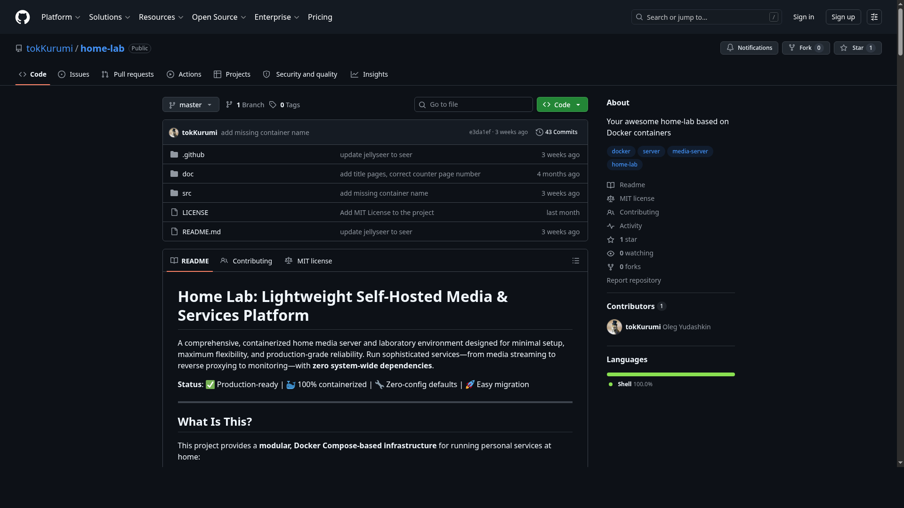
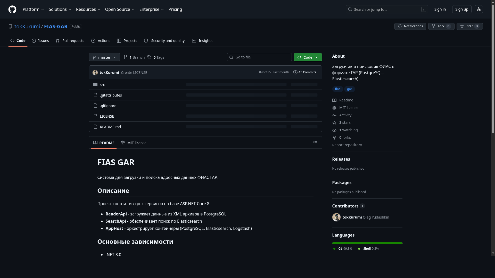
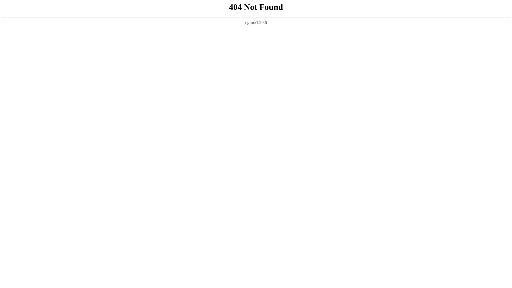

# Лабораторная работа 5. Ручное интеграционное тестирование веб-сайта

## Описание предмета тестирования

**Сайт:** https://portfolio.yudashkin-dev.ru/

Тестируемый объект — персональный сайт-портфолио разработчика. Основные функции для пользователя:

1. Просмотр профессиональной информации (о себе, ключевые навыки, опыт работы).
2. Переход по контактным ссылкам (телефон, email, Telegram, GitHub).
3. Просмотр и переход к pet-проектам на внешние ресурсы (GitHub).
4. Навигация по разделам страницы и проверка доступности сайта.

## Описание окружения тестирования

**Дата тестирования:** 17.04.2026

| Параметр | Значение |
|---|---|
| Операционная система | Arch Linux (rolling) |
| Ядро | Linux 6.19.11-arch1-1 x86_64 |
| Процессор | AMD Ryzen 7 5700X 8-Core Processor (16 логических CPU) |
| Оперативная память | 31 GiB |
| Swap | 4.0 GiB |
| Графическая сессия | Wayland |
| Desktop Environment / WM | Hyprland |
| Разрешение экрана | 2560x1440 |
| Браузер | Google Chrome 147.0.7727.55 |
| Пакет браузера (pacman) | google-chrome 147.0.7727.55-1 |
| Антивирусное ПО | Не использовалось |
| Сеть | Стабильное подключение к интернету |

### Команды, использованные для получения данных окружения

```bash
date
cat /etc/os-release
uname -srmo
lscpu
free -h
echo "$XDG_SESSION_TYPE"
echo "$XDG_CURRENT_DESKTOP"
pacman -Qi google-chrome
google-chrome-stable --version
xrandr --current
```

## Сценарии использования

Ниже приведены 4 сценария: 3 позитивных и 1 негативный.

### Сценарий UC-01 (позитивный)

**Название:** Доступность главной страницы и отображение основных секций.

**Цель пользователя:** Открыть сайт и просмотреть ключевую информацию.

**Предусловия:**

1. Браузер запущен.
2. Есть доступ в интернет.

**Шаги:**

1. Открыть URL: `https://portfolio.yudashkin-dev.ru/`.
2. Дождаться полной загрузки страницы.
3. Проверить наличие блоков: заголовок, навыки, опыт работы, контакты, pet-проекты.

**Ожидаемый результат:**

1. Сайт открывается без ошибок.
2. Отображаются все ключевые разделы портфолио.

---

### Сценарий UC-02 (позитивный)

**Название:** Переход по ссылкам на pet-проекты.

**Цель пользователя:** Перейти из портфолио в репозиторий заинтересовавшего проекта.

**Предусловия:**

1. Открыта главная страница сайта.

**Шаги:**

1. Прокрутить страницу до раздела «Интересные pet-проекты».
2. Нажать на ссылку проекта `home-lab`.
3. Убедиться, что открывается соответствующий репозиторий GitHub.
4. Вернуться назад и повторить действие для `FIAS-GAR`.

**Ожидаемый результат:**

1. Внешние ссылки корректно открывают соответствующие страницы GitHub.
2. Ошибки навигации отсутствуют.

---

### Сценарий UC-03 (позитивный)

**Название:** Проверка блока контактов.

**Цель пользователя:** Использовать контакты для связи с владельцем портфолио.

**Предусловия:**

1. Открыта главная страница сайта.

**Шаги:**

1. Перейти к разделу «Контакты».
2. Нажать на ссылку Email (mailto).
3. Нажать на ссылку Telegram.
4. Нажать на ссылку GitHub.

**Ожидаемый результат:**

1. Email-ссылка открывает обработчик почты (или предлагает выбрать приложение).
2. Telegram-ссылка ведет на корректный профиль.
3. GitHub-ссылка ведет на корректный профиль.

---

### Сценарий UC-04 (негативный)

**Название:** Переход на несуществующую страницу сайта.

**Цель пользователя:** Проверить реакцию сайта при обращении к невалидному URL.

**Предусловия:**

1. Есть доступ в интернет.

**Шаги:**

1. В адресной строке открыть: `https://portfolio.yudashkin-dev.ru/non-existent-page`.
2. Проверить HTTP-ответ и отображаемый результат в браузере.

**Ожидаемый результат:**

1. Сервер возвращает корректный код ошибки `404 Not Found`.
2. Браузер не зависает, пользователь получает предсказуемый результат.

## Результат ручного тестирования

### Сводная таблица

| ID | Тип | Статус | Фактический результат |
|---|---|---|---|
| UC-01 | Позитивный | Пройден | Главная страница доступна, ключевые разделы отображаются корректно. |
| UC-02 | Позитивный | Пройден | Ссылки на pet-проекты открывают соответствующие репозитории GitHub. |
| UC-03 | Позитивный | Пройден | Контактные ссылки (mailto, Telegram, GitHub) работают корректно. |
| UC-04 | Негативный | Пройден | Для несуществующего пути сервер возвращает `HTTP/2 404`, поведение предсказуемо. |

### Детализация выполнения со скриншотами

1. **UC-01**
   - Шаг 1-2: открыта главная страница сайта.
   - Результат: заголовок, блоки навыков, опыта, контактов и pet-проектов отображаются.
   - Скриншот:



2. **UC-02**
   - Шаг 1-2: выполнен переход по ссылке `home-lab`.
   - Результат: открыт репозиторий `https://github.com/tokKurumi/home-lab`.
   - Скриншот:



   - Шаг 4: выполнен переход по ссылке `FIAS-GAR`.
   - Результат: открыт репозиторий `https://github.com/tokKurumi/FIAS-GAR`.
   - Скриншот:



3. **UC-03**
   - Шаг 1: открыт раздел контактов.
   - Результат: отображаются телефон, email, Telegram, GitHub.
   - Скриншот:


   - Шаг 2-4: проверены `mailto`, Telegram и GitHub ссылки.
   - Результат: ссылки ведут на корректные целевые действия/страницы.
   - Скриншот:


4. **UC-04**
   - Шаг 1: выполнен переход на несуществующий URL.
   - Результат: получен `HTTP/2 404`.
   - Скриншот:



## Вывод

По итогам ручного интеграционного тестирования критичных дефектов не обнаружено.

1. Основная функциональность сайта-портфолио работает корректно.
2. Контактные и проектные ссылки открываются и ведут на ожидаемые ресурсы.
3. Негативный сценарий с невалидным URL обрабатывается корректно (возврат `404`).
